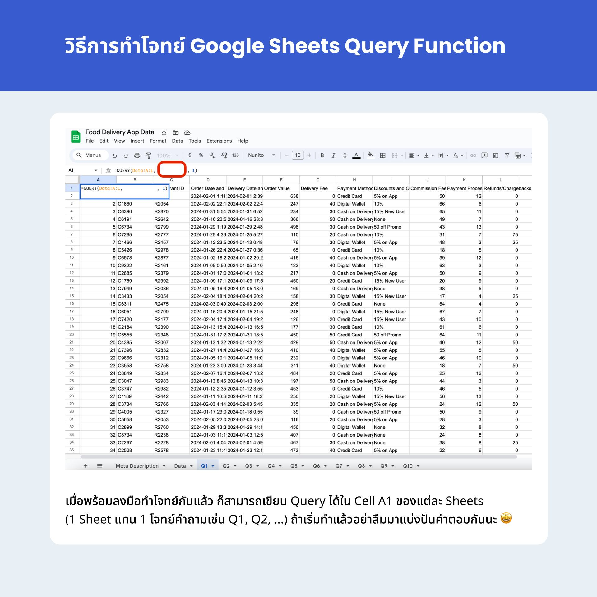

# SQL Query Challenge: Food Delivery App (Using Google Sheets Query Function)

บริษัทให้บริการจัดส่งอาหารผ่านแอปพลิเคชัน
สามารถให้บริการมาถึงยอด 1,000 ออเดอร์
ดังนั้นบริษัทจึงอยากใช้โอกาสนี้ในการวิเคราะห์ข้อมูลเพื่อลดต้นทุนการดำเนินงาน
และต้องการเพิ่มกำไรจากการให้บริการนี้

ในโจทย์นี้ เราจะฝึกใช้ Google Sheet Query Function
กัน โดยสามารถ Duplicate Google Sheet
ตัวโจทย์ได้ที่นี่
[Google Sheet Link](https://docs.google.com/spreadsheets/d/13Dw6DNsdgv8XrZz9dOwn6vUDUtz4wf8n-I3XK5CZXEs/edit?usp=sharing)

## คำอธิบายเกี่ยวกับชุดข้อมูล
| ตัวแปร | คำอธิบาย |
| --- | --- |
| Order ID | รหัสคำสั่งซื้อ |
| Customer ID | รหัสลูกค้า |
| Restaurant ID | รหัสร้านอาหาร |
| Order Date and Time | วันที่และเวลาที่ลูกค้าทำการสั่งซื้อ |
| Delivery Date and Time | วันที่และเวลาที่คำสั่งซื้อถูกจัดส่งถึงลูกค้า |
| Order Value | ยอดเงินรวมของสินค้าหรือบริการที่ลูกค้าสั่งซื้อ (ไม่รวมค่าจัดส่งและค่าธรรมเนียมอื่นๆ) (บาท) |
| Delivery Fee | ค่าธรรมเนียมที่เรียกเก็บจากลูกค้าสำหรับบริการจัดส่ง (บาท) |
| Payment Method | วิธีการชำระเงิน |
| Discounts and Offers | ส่วนลด (บาท) |
| Commission Fee | ค่าธรรมเนียมที่ร้านอาหารจ่ายให้กับแพลตฟอร์มจัดส่งอาหาร (บาท) |
| Payment Processing Fee | ค่าธรรมเนียมที่แพลตฟอร์มเรียกเก็บสำหรับช่องทางการชำระเงิน เช่น ค่าธรรมเนียมบัตรเครดิตหรือค่าธรรมเนียมการโอนเงิน (บาท) |
| Refunds/Chargebacks | มูลค่าเงินที่คืนให้กับลูกค้าในกรณีที่เกิดปัญหาหรือข้อโต้แย้ง (บาท) |

## แนวทางการใช้ Google Sheet Query Function

สำหรับโจทย์ Query
ของเราในครั้งนี้จะใช้เครื่องมือที่ใช้กันบ่อย ๆ
ในสายงานวิเคราะห์ข้อมูลอย่าง Google Sheets
และปัจจุบัน Google Sheets ยังรองรับการเขียน Query
Function ที่คล้ายกับ SQL อีกด้วย
ดังนั้นเราจึงมาลองฝึกการเขียน Query
ไว้ใช้ในการทำงานไปพร้อม ๆ กัน

รูปแบบการเขียน Query Function

`=QUERY(ช่วงข้อมูล, คำสั่ง Query, ระบุหัวตารางว่ามีหรือไม่มี)`

- `ช่วงข้อมูลคือ คอลัมน์ A ถึง จะเขียนได้ว่า A:L`
- `คำสั่ง Query คือการเขียน SQL แต่ตัวแปรที่อ้างถึงจะต้องเป็นคอลัมน์ *ไม่ใช่*ชื่อตัวแปรนะเช่น ต้องการ Select Order_ID ที่อยู่ในคอลัมน์ A จะเขียนได้ว่า Select A`
- `ระบุหัวตาราง คือช่วงข้อมูลที่เราเลือกติดหัวตารางหรือไม่ ถ้าใช้ให้ระบุ 1 ถ้าไม่ใช่ให้ระบุ 2`

เช่น สมมติว่ามี Sheet ชื่อ `Data`
ที่มีข้อมูลในช่วง `A1:L1000` และต้องการดึงข้อมูล
`Order ID Customer ID` และ `Order Value`
ที่อยู่ในในคอลัมน์ `A`, `B` และ `F` ตามลำดับ
โดยที่มีเงื่อนไขว่าต้องการข้อมูลในช่วงคอลัมน์ `F`
มากกว่า 450 บาท จะเขียนประกอบร่างฟังก์ชันได้ดังนี้

**`=QUERY(Data!A1:L1000, "SELECT A, B, F WHERE F > 450", 1)`**

[รายละเอียดเกี่ยวกับ Google Sheet Query Function](https://support.google.com/docs/answer/3093343?hl=en)

## วิธีทำโจทย์

เมื่อพร้อมลงมือทำโจทย์กันแล้วสามารถเขียน Query
ได้ใน Cell A1 แต่ละ Sheets ทั้ง 10
ข้อเรียบร้อยแล้ว
ถ้าเริ่มทำแล้วอย่าลืมมาแบ่งปันคำตอบกันนะ 🤩

### Q1: แสดง Order ID, Customer ID และ Order Value สำหรับคำสั่งซื้อที่มีมูลค่ามากกว่า 450 บาท

- [Answer](/data-analytic/7/1.sql)

### Q2: แสดง Customer ID และยอดรวมของ Order Value ของลูกค้าแต่ละคน

- [Answer](/data-analytic/7/2.sql)

### Q3: แสดง Order ID, Payment Method และ Order Value สำหรับคำสั่งซื้อที่ใช้วิธีการชำระเงินเป็นบัตรเครดิต

- [Answer](/data-analytic/7/3.sql)

### Q4: แสดง Order ID, Order Date and Time, และ Payment Method สำหรับคำสั่งซื้อที่มีการชำระเงินเป็นเงินสด

- [Answer](/data-analytic/7/4.sql)

### Q5: แสดง Customer ID และนับจำนวน Order ID สำหรับลูกค้าที่ซื้อซ้ำมากที่สุด

- [Answer](/data-analytic/7/5.sql)

### Q6: แสดง Restaurant ID และยอดรวมของ Order Value, Delivery Fee, Commission Fee และ Payment Processing Fee สำหรับร้านอาหารแต่ละแห่ง

- [Answer](/data-analytic/7/6.sql)

### Q7: แสดง Order ID, Customer ID และ Order Value

สำหรับคำสั่งซื้อที่ไม่ได้รับส่วนลด (Discounts and
Offers เป็น 0) และมีค่าธรรมเนียมการชำระเงิน
(Payment Processing Fee) มากกว่า 10 บาท

- [Answer](/data-analytic/7/7.sql)

### Q8: แสดง Restaurant ID และยอดรวมของ Commission Fee ของแต่ละร้านอาหาร แล้วเรียงผลรวมของ Commission Fee จากมากไปน้อย

- [Answer](/data-analytic/7/8.sql)

### Q9: แสดง Order ID, Customer ID, และ Order Value สำหรับคำสั่งซื้อ (Order Value) ที่มีค่าสูงสุด

- [Answer](/data-analytic/7/9.sql)

### Q10: แสดง Order Date and Time, Order ID, และ ค่า Order Value สำหรับคำสั่งซื้อ (Order Value) ที่มีค่าต่ำสุด

- [Answer](/data-analytic/7/10.sql)
